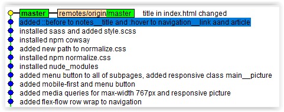

# Homepage of Tomasz Kwietniewski

This page is a result of few lessons with Maciej Korsan.

## How to use it?

Click on `Use this template` button to generate a new repository based on this starter kit. After that clone it to your computer, go to the project directory in console and type `npm install`.

## Available scripts

`npm run start` - runs development mode

`npm run build` - runs build process for production

`npm run publish` - runs build process and publish the page using `gh-pages` branch

## [Most valuable project in my life](https://docs.google.com/spreadsheets/d/e/2PACX-1vRp1PenhYY0-O0WewbsiRf6ggpLbJojuEl6JwLxOspWgxGShl4RE5nR92RnJZ9j2VlXMf29hUX-qGRh/pubhtml)
